# YANG Library Ontology

Online documentation: https://w3id.org/yang/library



## Local Development

We encourage to locally develop the ontology documentation before publishing it online. For this, we recommend running WIDOCO tool via Docker container.

To generate the documentation, issue the following command:

```bash
./generate-docs.sh
```
