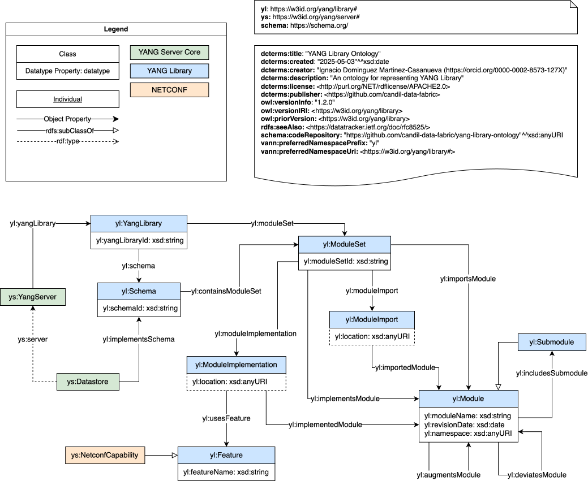

# YANG Library Ontology

## Purpose and Scope

Ontology that captures details about the YANG data models implemented in a YANG server like NETCONF. The ontology represents the YANG modules and submodules implemented or imported by a YANG server, and more especifically, a YANG datastore in the case of NMDA-enabled devices. The ontology captures different types of dependencies between modules like deviations or augmentations. Additionally, it captures the definition of YANG features and their use in the implementation of the respective YANG modules.

This ontology enables network operators to discover the YANG data models that their network devices implement, identifying the set of YANG modules and submodules that comprise each YANG data model, and therefore, to be compiled together by YANG clients.

## Vocabulary Development

This ontology is developed following the guidelines of the [LOT methodology](https://lot.linkeddata.es).

### Requirements

The requirements of this ontology are written as competency questions/natural language statements, which have been captured in a [CSV file](./requirements/requirements.csv).

### Ontology Model

The following diagrams shows the classes and properties defined in the ontology. The diagram follows the [Chowlk notation](https://chowlk.linkeddata.es/notation.html).



### Ontology Code (OWL)

The OWL code of the ontology, serialized in Turtle format, is available [here](./ontology/yang-library.ttl).

### Examples

Sample RDF datasets are provided in the [examples folder](./examples/).

### Evaluation

This ontology is evaluated using the following tools:
- [OOPS](https://oops.linkeddata.es)
- [FOOPS](https://foops.linkeddata.es/FAIR_validator.html)
- SPARQL queries

The evaluation reports from OOPS and FOOPS, along with the SPARQL queries, are available in the [evaluation folder](./evaluation/).

### Documentation

The ontology documentation was generated using the WIDOCO tool and published online at: https://w3id.org/yang/server

We encourage to locally develop the ontology documentation before publishing it online. For this, we recommend running WIDOCO tool via Docker container.

To generate the documentation, execute the following command:

```bash
./generate-docs.sh
```
